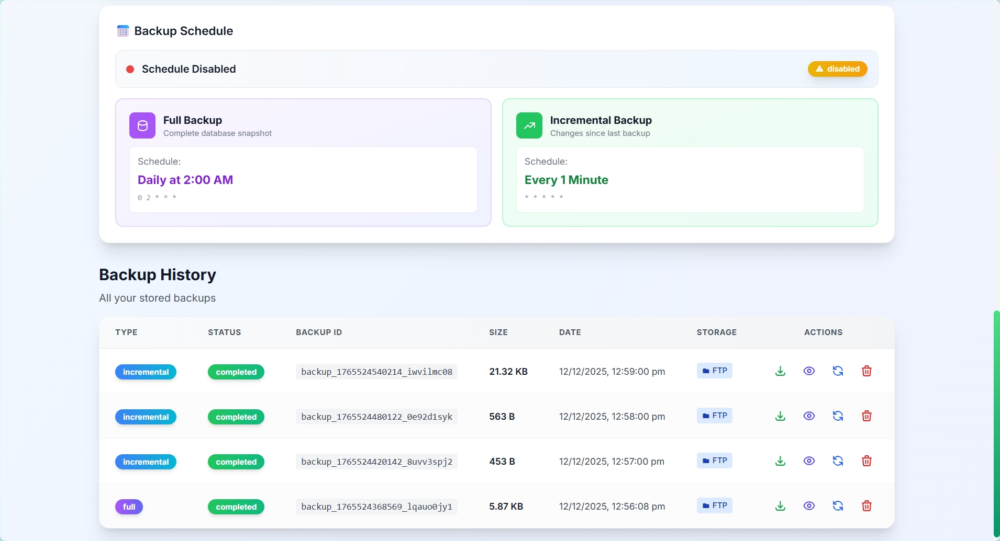

# MongoDB Backup Manager

A production-ready, web-based MongoDB backup solution with scheduling, FTP upload, incremental backups, and point-in-time recovery capabilities.


## Project Status

This project is actively developed and has been tested in real-world self-hosted MongoDB environments.

While core features such as full backups, incremental backups, scheduling, and restore workflows are stable, users are encouraged to test the setup in a non-production environment before relying on it for critical data.

Contributions, testing feedback, and issue reports are welcome.

> ⚠️ **Important**: For incremental backups to work, your MongoDB server **must** be configured as a Replica Set (even a single-node replica set). This is required to access the MongoDB `oplog` for tracking changes. Without this, incremental backups will fail.

---

## Features

**Backup Management**
- Full database backups with compression (gzip/tar)
- Incremental backups using MongoDB oplog
- Point-in-time recovery (PITR) support
- Automatic backup rotation and retention policies

**Storage & Transfer**
- Local backup storage with configurable retention
- FTP/SFTP upload to remote servers
- Automatic cleanup of old backups

**Scheduling & Automation**
- Flexible cron-based scheduling
- Separate schedules for full and incremental backups
- Real-time backup status monitoring

**Security**
- JWT-based authentication
- Encrypted credential storage
- Password change support

**User Interface**
- Clean, responsive web dashboard
- Real-time backup progress tracking
- Log viewing and filtering
- Backup inspection and verification


## Screenshots

### Dashboard


### Backup Management


### Restore Operations


---

## Quick Start

### Using Docker (Recommended)

```bash
# Clone the repository
git clone https://github.com/likhith1409/MongoDB-Backup-Manager.git
cd MongoDB-Backup-Manager

# Copy environment file and configure
cp .env.example .env
# Edit .env with your settings

# Start with Docker Compose
docker-compose up -d
```

Access the dashboard at **http://localhost:5552**

Default credentials:
- Username: `admin`
- Password: `admin`

> ⚠️ **Important**: Change the default credentials immediately after first login!

### Manual Installation

**Prerequisites**
- Node.js 18 or higher
- MongoDB Tools (`mongodump`, `mongorestore`)
- MongoDB Replica Set (Required for incremental backups)
- npm or yarn

**Steps**

```bash
# Clone the repository
git clone https://github.com/likhith1409/MongoDB-Backup-Manager.git
cd MongoDB-Backup-Manager

# Install all dependencies
npm run install:all

# Copy and configure environment
cp .env.example .env
# Edit .env with your MongoDB connection and other settings

# Build the frontend
npm run build

# Start the server
npm start
```

**Development Mode**

```bash
# Start both frontend and backend in development mode
npm run dev
```

- Frontend: http://localhost:5551
- Backend API: http://localhost:5552

---

## Configuration

### Environment Variables

| Variable | Description | Default |
|----------|-------------|---------|
| `PORT` | Backend server port | `5552` |
| `HOST` | Server bind address | `0.0.0.0` |
| `NODE_ENV` | Environment mode | `production` |
| `ADMIN_USER` | Admin username | `admin` |
| `ADMIN_PASS` | Admin password | `admin` |
| `JWT_SECRET` | JWT signing secret | - |
| `MONGO_URL` | MongoDB connection string | - |
| `FTP_HOST` | FTP server hostname | - |
| `FTP_PORT` | FTP server port | `21` |
| `FTP_USER` | FTP username | - |
| `FTP_PASSWORD` | FTP password | - |
| `FTP_BASE_PATH` | FTP upload directory | `/backups` |
| `FTP_ENABLED` | Enable FTP uploads | `false` |
| `KEEP_LOCAL_BACKUPS` | Keep local copies | `true` |
| `KEEP_LAST_N_BACKUPS` | Max local backups | `30` |
| `RETENTION_DAYS` | Auto-delete after days | `30` |
| `BACKUP_CRON` | Backup schedule (cron) | `0 2 * * *` |
| `SETTINGS_ENCRYPTION_KEY` | Encryption key (32+ chars) | - |

### Cron Schedule Examples

| Expression | Description |
|------------|-------------|
| `0 2 * * *` | Daily at 2:00 AM |
| `0 */6 * * *` | Every 6 hours |
| `0 0 * * 0` | Weekly on Sunday |
| `0 0 1 * *` | Monthly on the 1st |

---

## Project Structure

```
mongodb-backup-manager/
├── client/                 # React frontend (Vite + Tailwind)
│   ├── src/
│   │   ├── components/     # Reusable UI components
│   │   ├── contexts/       # React contexts
│   │   ├── pages/          # Page components
│   │   └── utils/          # Utilities and API client
│   └── ...
├── server/                 # Express backend
│   ├── middleware/         # Auth and other middleware
│   ├── routes/             # API route handlers
│   ├── services/           # Core business logic
│   └── tests/              # Unit tests
├── data/                   # Backups and database (gitignored)
├── docker-compose.yml      # Docker Compose configuration
├── Dockerfile              # Multi-stage Docker build
└── .env.example            # Environment template
```

---

## API Reference

### Authentication
| Method | Endpoint | Description |
|--------|----------|-------------|
| POST | `/api/auth/login` | Login and get JWT token |
| POST | `/api/auth/logout` | Logout |
| POST | `/api/auth/change-password` | Change password |

### Backups
| Method | Endpoint | Description |
|--------|----------|-------------|
| GET | `/api/backup/list` | List all backups |
| POST | `/api/backup/full` | Trigger full backup |
| POST | `/api/backup/incremental` | Trigger incremental backup |
| GET | `/api/backup/:id/inspect` | Inspect backup contents |
| DELETE | `/api/backup/:id` | Delete a backup |

### Restore
| Method | Endpoint | Description |
|--------|----------|-------------|
| POST | `/api/restore/:id` | Restore from backup |
| POST | `/api/restore/pitr` | Point-in-time restore |

### Settings
| Method | Endpoint | Description |
|--------|----------|-------------|
| GET | `/api/settings` | Get current settings |
| PUT | `/api/settings` | Update settings |
| POST | `/api/settings/test-ftp` | Test FTP connection |

### Logs
| Method | Endpoint | Description |
|--------|----------|-------------|
| GET | `/api/logs` | Get backup logs |

### Health
| Method | Endpoint | Description |
|--------|----------|-------------|
| GET | `/health` | Health check endpoint |

---

## Deployment

### Systemd Service (Linux)

```bash
# Copy service file
sudo cp mongodb-backup.service /etc/systemd/system/

# Reload systemd
sudo systemctl daemon-reload

# Enable and start service
sudo systemctl enable mongodb-backup-manager
sudo systemctl start mongodb-backup-manager

# Check status
sudo systemctl status mongodb-backup-manager
```

### Docker Production

```bash
# Build and run
docker-compose up -d

# View logs
docker-compose logs -f app

# Stop
docker-compose down
```

### Nginx Reverse Proxy (Optional)

```nginx
server {
    listen 80;
    server_name backup.yourdomain.com;

    location / {
        proxy_pass http://localhost:5552;
        proxy_http_version 1.1;
        proxy_set_header Upgrade $http_upgrade;
        proxy_set_header Connection 'upgrade';
        proxy_set_header Host $host;
        proxy_set_header X-Real-IP $remote_addr;
        proxy_cache_bypass $http_upgrade;
    }
}
```

---

## Troubleshooting

### Common Issues

**Cannot connect to MongoDB**
- Verify the `MONGO_URL` is correct and accessible
- Check if MongoDB is running and accepting connections
- Ensure network/firewall allows the connection

**Backups failing**
- Check if `mongodump` is installed and in PATH
- Verify MongoDB user has backup privileges
- Check available disk space

**FTP upload failing**
- Test FTP connection from Settings page
- Verify FTP credentials and permissions
- Check if passive mode is required

**Authentication issues**
- Clear browser localStorage and try again
- Check if JWT_SECRET is configured
- Verify ADMIN_USER/ADMIN_PASS in .env

### Logs

View application logs:
```bash
# Docker
docker-compose logs -f app

# Systemd
journalctl -u mongodb-backup-manager -f

# Manual
cat server/logs/app.log
```

---

## Contributing

Contributions are welcome! Please read our [Contributing Guide](CONTRIBUTING.md) for details on:
- Development setup
- Code style guidelines
- Pull request process
- Issue reporting

---

## License

This project is licensed under the MIT License - see the [LICENSE](LICENSE) file for details.

---

## Acknowledgments

- MongoDB for the excellent database tools
- The Node.js and Express communities
- All contributors and users of this project
